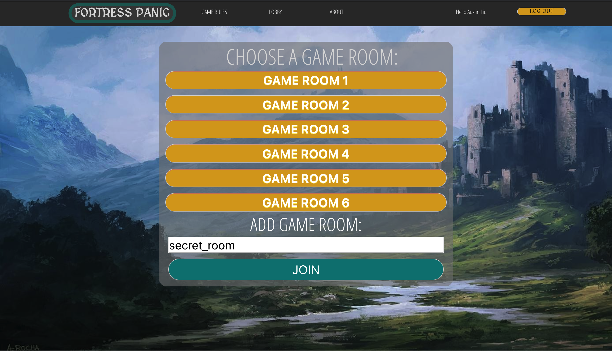

# Fortress Panic

An online adaptation of the popular board game **Castle Panic!**, a fully cooperative game where 1-6 players play as castle protectors attempting to defend the 6 castle towers from monsters trying to destroy the castle. The current version implements the basic version of the game with some additional monsters/ streamlined changes.

### Find Fortress Panic here!: [d1axndhfbi0h3m.cloudfront.net/](http://d1axndhfbi0h3m.cloudfront.net)!

## Technologies used

- React
- Redux
- Firebase
- MongoDb/Mongoose
- Node.js
- Heroku (For Backend Server)
- AWS (For Frontend Hosting)
- Express
- Socket.io
- Scss
- Webpack
- Babel

## How to run locally
1) Clone this repository.
2) Go to api folder `cd api`
3) Install dependencies with `npm install`
4) Start development build using Webpack with `npm run dev`
5) Start server `npm start`
6) Open localhost:9000

### Made by:
- Austin Liu
